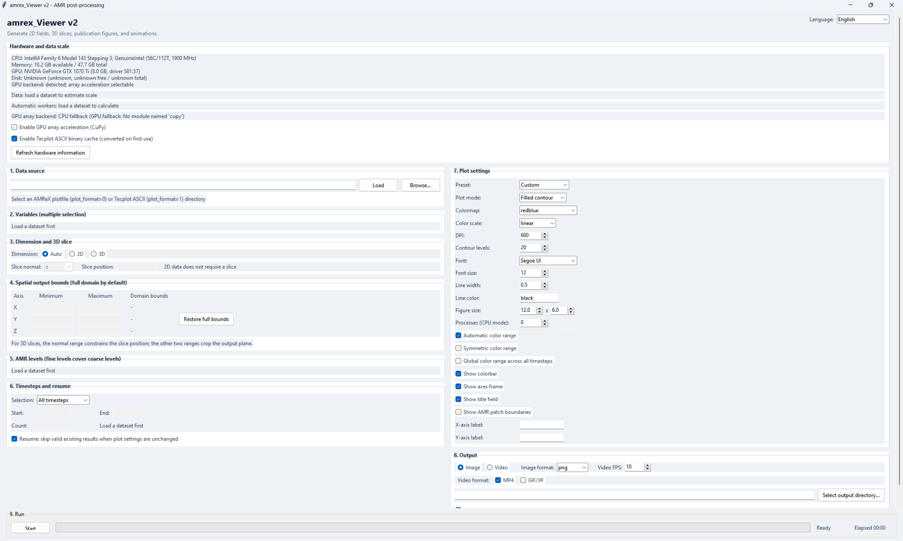

# AMReX_SliceViewer

<p align="center">
  <strong>English</strong> | <a href="README.zh-CN.md">简体中文</a>
</p>

AMReX_SliceViewer is a Python desktop application and command-line tool for
visualizing AMReX adaptive mesh refinement (AMR) simulation data.

It supports interactive inspection, batch rendering, 2D scalar fields, 3D
orthogonal slices, AMR levels, Tecplot ASCII data, and AMReX plotfiles. Output
can be written as publication-quality images or as MP4/GIF animations.

<p align="center">
  
</p>

## Contents

- [Highlights](#highlights)
- [Installation](#installation)
- [Language and Fonts](#language-and-fonts)
- [Quick Start: GUI](#quick-start-gui)
- [Quick Start: CLI](#quick-start-cli)
- [Supported Input Data](#supported-input-data)
- [Demo Media](#demo-media)
- [Project Layout](#project-layout)

## Highlights

- Interactive Tkinter GUI for dataset inspection and rendering.
- Command-line batch processing for reproducible workflows.
- AMReX plotfile and structured Tecplot ASCII input.
- Multi-level AMR visualization and patch inspection.
- 2D fields and X/Y/Z slices for 3D data.
- Filled contours, line contours, or a combined view.
- Linear or logarithmic color normalization.
- Custom color limits, symmetric ranges, labels, titles, and colorbars.
- PNG, JPEG, TIFF, SVG, and PDF image output.
- MP4 and GIF animation output.
- Optional CuPy/CUDA array acceleration with automatic CPU fallback.
- Tecplot ASCII binary caching for repeated runs.
- Resume support that skips existing output files.
- English and Simplified Chinese interfaces with automatic system-language detection.
- Native launch scripts and font fallbacks for Windows, Linux, and macOS.

## What You Can Visualize

| Workflow | What it provides | Typical use |
| --- | --- | --- |
| AMR inspection | Levels, patches, variables, time steps, and bounds | Understand a dataset before rendering |
| 2D scalar fields | Filled contours, isolines, or both | Planar CFD and scalar-field analysis |
| 3D slices | X, Y, or Z orthogonal slices | Inspect internal planes in 3D results |
| Color analysis | Linear/log normalization and fixed limits | Compare magnitudes across frames |
| Batch rendering | Multiple variables, levels, and time steps | Reproducible post-processing |
| Media export | PNG/JPG/TIFF/SVG/PDF, MP4, and GIF | Papers, presentations, and README demos |

## Installation

Python 3.10 or newer is recommended. GPU acceleration is optional; without
CuPy, CUDA, or an NVIDIA device, the application automatically uses NumPy on
the CPU.

### Windows

The installer creates `.venv` and installs the CPU dependencies:

```powershell
.\install_dependencies_windows.bat
```

Manual installation is also supported:

```powershell
py -3 -m venv .venv
.\.venv\Scripts\Activate.ps1
python -m pip install --upgrade pip
python -m pip install -r requirements.txt
```

### Linux

Install Python, Tk, and virtual-environment support with the package manager
for your distribution. For Ubuntu/Debian:

```bash
sudo apt install python3 python3-venv python3-tk
bash install_dependencies_unix.sh
```

For the best Chinese text coverage, install a CJK font package such as
`fonts-noto-cjk` when it is not already present.

### macOS

Install Python 3 with Tk support, then run:

```bash
bash install_dependencies_unix.sh
```

The Python installer from python.org includes a compatible Tk build. If a
package-manager Python is used, make sure its matching Tk package is installed.

### Optional NVIDIA GPU Support

On Windows or Linux with a compatible NVIDIA CUDA installation:

```bash
python -m pip install -r requirements-gpu.txt
```

CuPy is not supported on macOS; the CPU backend is selected automatically.

## Language and Fonts

The GUI follows the operating-system language on first launch. Use the
language selector in the upper-right corner to switch immediately between:

- System default
- English
- Simplified Chinese

The selection is remembered in the normal per-user settings directory for
Windows, macOS, or Linux. No project file is modified. The application also
selects an installed UI and plotting font appropriate for the current system:

| Platform | Preferred Chinese fonts | Desktop integration |
| --- | --- | --- |
| Windows | Microsoft YaHei UI / Microsoft YaHei | High-DPI awareness and Explorer |
| macOS | PingFang SC / Hiragino Sans GB | Finder |
| Linux | Noto Sans CJK SC / Source Han Sans SC / WenQuanYi | `xdg-open` file manager |

If a preferred font is unavailable, the GUI and Matplotlib automatically fall
back to another installed font. This keeps Chinese labels and minus signs
readable without hard-coding a Windows-only font.

The CLI accepts the same language choices before the subcommand:

```bash
python backend_cli.py --language en inspect "/path/to/case"
python backend_cli.py --language zh_CN inspect "/path/to/case"
```

For automation, set `AMREX_VIEWER_LANG` to `auto`, `en`, or `zh_CN`.

## Quick Start: GUI

<p align="center">
  
</p>

<p align="center"><em>Main interface with hardware detection, dataset controls, rendering settings, and image/video output.</em></p>

Start the desktop application with the launcher for your system:

```powershell
.\run_windows.bat
```

```bash
# Linux
bash run_linux.sh

# macOS
chmod +x run_macos.command
./run_macos.command
```

All platforms can also run the entry point directly:

```bash
python main.py
```

In the GUI:

1. Select an AMReX plotfile or a directory containing Tecplot ASCII files.
2. Inspect the detected dimension, variables, time steps, and AMR levels.
3. Select the field, levels, slice settings, colormap, and output format.
4. Select an output directory and click the render button.

The `Video output` preset is a convenient starting point for animations.
Select MP4, GIF/JIF, or both in the output section.

### Recommended GUI Workflow

1. Use the dataset picker to select the root directory, not an individual
   frame file.
2. Confirm the detected input format and dimension in the metadata panel.
3. Select only the variables and AMR levels needed for the first test run.
4. Render one or two time steps first and inspect the color range and slice
   position.
5. Enable the global color range when an animation must remain comparable from
   frame to frame.
6. Switch to the video output preset, choose MP4, GIF/JIF, or both, and then
   render the complete time range.

The GUI is best for exploring settings interactively. Once the settings are
known, the CLI is better for repeating the same analysis on another case.

## Quick Start: CLI

Inspect a dataset before rendering:

```powershell
python backend_cli.py inspect "D:\simulations\case"
```

Render images for one variable and all available time steps:

```powershell
python backend_cli.py render "D:\simulations\case" `
  --output "D:\simulations\rendered" `
  --variables rho `
  --output-type image `
  --image-format png
```

Render an MP4 and GIF animation at the same time:

```powershell
python backend_cli.py render "D:\simulations\case" `
  --output "D:\simulations\rendered" `
  --variables rho `
  --timesteps 0-1000 `
  --levels all `
  --mode contourf `
  --cmap turbo `
  --global-color `
  --output-type video `
  --video-format both `
  --fps 12
```

For a 3D dataset, select a slice direction and position:

```powershell
python backend_cli.py render "D:\simulations\case" `
  --output "D:\simulations\rendered" `
  --variables rho `
  --dimension 3 `
  --slice-axis z `
  --slice-position 0.5 `
  --output-type video `
  --video-format mp4
```

Useful CLI options include:

| Option | Description |
| --- | --- |
| `--variables rho,p,T` | Comma-separated field names |
| `--language auto\|en\|zh_CN` | Interface and console language; place before `inspect` or `render` |
| `--levels 0,1,2` | AMR levels to render |
| `--timesteps 0,500,1000-3000` | Selected time steps |
| `--mode contourf\|contour\|both` | Rendering mode |
| `--norm linear\|log` | Color normalization |
| `--global-color` | Use one color range for all frames |
| `--video-format mp4\|gif\|both` | Animation format |
| `--no-gpu` | Force the NumPy/CPU backend |
| `--no-resume` | Re-render existing output files |

Run `python backend_cli.py render --help` for the complete option list.

### Typical CLI Workflow

```text
inspect data -> choose variables and time steps -> render images -> review -> render video
```

For publication figures, prefer a high DPI image output. For README media,
use a moderate figure size and frame rate so the repository remains easy to
clone.

## Supported Input Data

The application currently recognizes:

- AMReX plotfiles containing `Header` and `Level_0/Cell_H`.
- Structured Tecplot ASCII files with the `.dat` extension.

Tecplot binary `.plt` files can be detected, but TDV112 field data is not
currently read by the renderer. Export the data as an AMReX plotfile or
Tecplot ASCII when necessary.

## Demo Media

The renderer can generate MP4 and GIF files directly with
`--output-type video` and `--video-format both`.

<p align="center">
  
</p>

<p align="center">
  <strong>Rho-gradient evolution across 139 simulation frames</strong><br>
  <a href="docs/media/rhograd.mp4">Open or download the MP4 version</a>
</p>

GIF is the most portable choice for an inline README preview. Keep large MP4
files in GitHub Releases or Git LFS if they make the repository unnecessarily
large.

For a visual project page, a useful media set is:

| File | Purpose |
| --- | --- |
| `docs/media/workflow.svg` | Always-present overview of the processing pipeline |
| `docs/media/gui-home-en.png` | English desktop application screenshot |
| `docs/media/gui-home-zh.png` | Simplified Chinese desktop application screenshot |
| `docs/media/rhograd.gif` | Inline animation visible in most Markdown viewers |
| `docs/media/rhograd.mp4` | Higher-quality animation for browsers and downloads |

## Project Layout

```text
AMReX_SliceViewer/
|-- main.py                         # GUI entry point
|-- gui.py                          # Tkinter user interface
|-- backend_cli.py                  # CLI entry point
|-- amr_backend.py                  # Dataset detection and loading
|-- visualizer.py                   # Rendering and animation generation
|-- gpu_backend.py                  # CuPy backend with CPU fallback
|-- runtime_policy.py               # Worker and runtime decisions
|-- hardware_info.py                # Hardware detection
|-- i18n.py                         # Language detection and translations
|-- platform_support.py             # DPI, fonts, and file-manager integration
|-- requirements.txt                # CPU dependencies
|-- requirements-gpu.txt            # Optional GPU dependency
|-- run_windows.bat                 # Windows launcher
|-- run_linux.sh                    # Linux launcher
|-- run_macos.command               # macOS launcher
`-- docs/media/                     # README images and animations
```

## Development Notes

- Generated simulation output is excluded by `.gitignore`.
- Output directories and large CFD data files should not be committed to the
  source repository.
- Use `--global-color` for animations when frame-to-frame color consistency is
  important.
- Use `--no-gpu` to reproduce a CPU-only run or diagnose GPU environment issues.

## License

No license file is currently included in this repository. Add a license before
publishing the project if you want to define how others may use, modify, and
redistribute the code.
