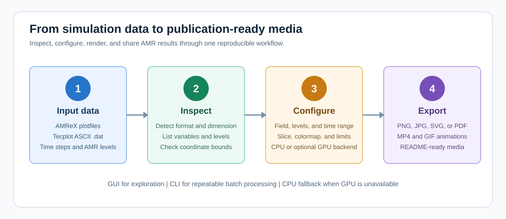
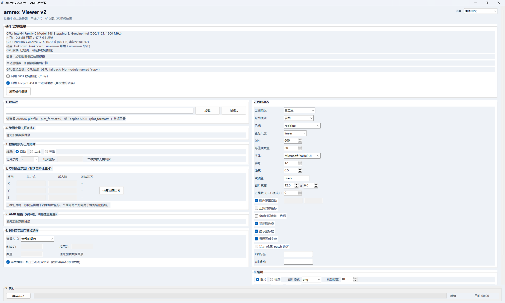
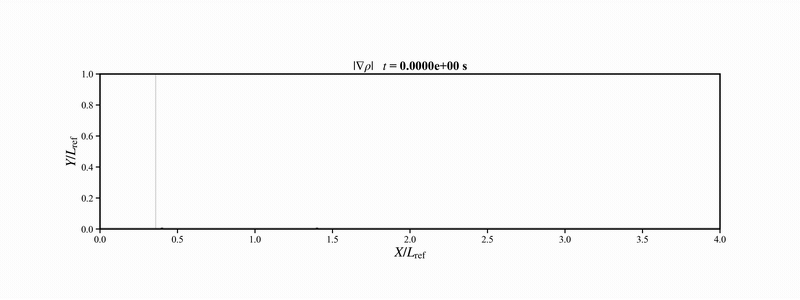

# AMReX_SliceViewer

<p align="center">
  <a href="README.md">English</a> | <strong>简体中文</strong>
</p>

AMReX_SliceViewer 是一个用于可视化 AMReX 自适应网格加密（AMR）模拟数据的
Python 桌面应用程序和命令行工具。

软件支持交互式数据检查、批量绘图、二维标量场、三维正交切片、多层级 AMR、
Tecplot ASCII 数据和 AMReX plotfile，可输出论文级图片以及 MP4/GIF 动画。

<p align="center">
  
</p>

## 目录

- [主要功能](#主要功能)
- [安装](#安装)
- [语言与字体](#语言与字体)
- [GUI 快速开始](#gui-快速开始)
- [CLI 快速开始](#cli-快速开始)
- [支持的数据格式](#支持的数据格式)
- [演示媒体](#演示媒体)
- [项目结构](#项目结构)

## 主要功能

- 使用 Tkinter GUI 交互式检查和渲染数据。
- 使用命令行进行可复现的批量后处理。
- 支持 AMReX plotfile 和结构化 Tecplot ASCII 输入。
- 支持多层级 AMR 可视化与 patch 边界检查。
- 支持二维场和三维数据的 X/Y/Z 正交切片。
- 支持填色云图、等值线及二者叠加模式。
- 支持线性与对数色标。
- 支持自定义颜色范围、正负对称色标、坐标标签、标题和 colorbar。
- 支持 PNG、JPEG、TIFF、SVG 和 PDF 图片输出。
- 支持 MP4 和 GIF 动画输出。
- 支持可选的 CuPy/CUDA 数组加速，并可自动回退 CPU。
- 支持 Tecplot ASCII 二进制缓存，加快重复读取。
- 支持断点续作，跳过已有的有效输出。
- 提供英文、简体中文界面及系统语言自动检测。
- 提供 Windows、Linux、macOS 启动脚本和字体回退机制。

## 可视化能力

| 工作流程 | 提供的功能 | 典型用途 |
| --- | --- | --- |
| AMR 数据检查 | 层级、patch、变量、时间步和坐标范围 | 绘图前了解数据集结构 |
| 二维标量场 | 填色云图、等值线或二者叠加 | 平面 CFD 与标量场分析 |
| 三维切片 | X、Y 或 Z 方向正交切片 | 查看三维结果内部平面 |
| 色标分析 | 线性/对数归一化与固定范围 | 对比不同帧的数据量级 |
| 批量绘图 | 多变量、多层级和多时间步 | 可复现的批量后处理 |
| 媒体导出 | PNG/JPG/TIFF/SVG/PDF、MP4 和 GIF | 论文、报告及 README 演示 |

## 安装

推荐使用 Python 3.10 或更高版本。GPU 加速是可选功能；未安装 CuPy、CUDA
或没有 NVIDIA GPU 时，软件会自动使用 NumPy/CPU 后端。

### Windows

运行安装脚本，自动创建 `.venv` 并安装 CPU 依赖：

```powershell
.\install_dependencies_windows.bat
```

也可以手动安装：

```powershell
py -3 -m venv .venv
.\.venv\Scripts\Activate.ps1
python -m pip install --upgrade pip
python -m pip install -r requirements.txt
```

### Linux

请使用发行版的软件包管理器安装 Python、Tk 和虚拟环境支持。Ubuntu/Debian：

```bash
sudo apt install python3 python3-venv python3-tk
bash install_dependencies_unix.sh
```

为了获得更完整的中文字符显示，建议在系统未预装时安装 `fonts-noto-cjk`
等 CJK 字体包。

### macOS

安装支持 Tk 的 Python 3，然后运行：

```bash
bash install_dependencies_unix.sh
```

python.org 提供的 Python 安装程序包含兼容的 Tk。使用包管理器安装 Python 时，
请同时安装与其匹配的 Tk 软件包。

### 可选的 NVIDIA GPU 支持

在配有兼容 NVIDIA CUDA 环境的 Windows 或 Linux 系统上运行：

```bash
python -m pip install -r requirements-gpu.txt
```

CuPy 不支持 macOS，因此 macOS 会自动使用 CPU 后端。

## 语言与字体

GUI 首次启动时默认跟随操作系统语言。使用右上角的语言选择器可立即切换：

- 跟随系统
- English
- 简体中文

软件会把选择保存在 Windows、macOS 或 Linux 的标准用户设置目录中，
不会修改项目文件。软件还会根据当前系统选择合适的界面字体和绘图字体：

| 平台 | 优先使用的中文字体 | 桌面集成 |
| --- | --- | --- |
| Windows | Microsoft YaHei UI / Microsoft YaHei | 高 DPI 感知和资源管理器 |
| macOS | PingFang SC / Hiragino Sans GB | Finder |
| Linux | Noto Sans CJK SC / Source Han Sans SC / WenQuanYi | `xdg-open` 文件管理器 |

首选字体不可用时，GUI 和 Matplotlib 会自动选择其他已安装字体，避免中文标签、
负号和路径出现方框或乱码。

CLI 同样支持语言选择，`--language` 需要放在子命令之前：

```bash
python backend_cli.py --language en inspect "/path/to/case"
python backend_cli.py --language zh_CN inspect "/path/to/case"
```

自动化脚本还可以把环境变量 `AMREX_VIEWER_LANG` 设置为 `auto`、`en` 或
`zh_CN`。

## GUI 快速开始

<p align="center">
  
</p>

<p align="center"><em>包含硬件检测、数据控制、绘图设置及图片/视频输出的中文主界面。</em></p>

使用对应系统的启动脚本运行桌面应用：

```powershell
.\run_windows.bat
```

```bash
# Linux
bash run_linux.sh

# macOS
chmod +x run_macos.command
./run_macos.command
```

所有平台也可以直接运行入口文件：

```bash
python main.py
```

GUI 基本操作：

1. 选择 AMReX plotfile，或包含 Tecplot ASCII 文件的数据目录。
2. 检查软件识别的数据维度、变量、时间步和 AMR 层级。
3. 选择绘图变量、层级、切片设置、色标和输出格式。
4. 选择输出目录，然后单击开始生成。

需要生成动画时，可以从“视频输出”预设开始，在输出区域选择 MP4、GIF/JIF
或同时选择两种格式。

### 推荐的 GUI 工作流程

1. 使用数据选择器选择结果根目录，不要选择单独的帧文件。
2. 在元数据区域确认输入格式和数据维度。
3. 首次试算时只选择必要的变量和 AMR 层级。
4. 先生成一两个时间步，检查色标范围和切片位置。
5. 动画各帧需要保持可比性时，启用“全部时间步统一色标”。
6. 切换到“视频输出”预设，选择 MP4、GIF/JIF 或两者，然后生成完整时间范围。

GUI 适合交互式探索绘图参数。确定参数后，可使用 CLI 在其他算例上重复同一流程。

## CLI 快速开始

绘图前检查数据集：

```powershell
python backend_cli.py --language zh_CN inspect "D:\simulations\case"
```

为一个变量和全部可用时间步生成图片：

```powershell
python backend_cli.py --language zh_CN render "D:\simulations\case" `
  --output "D:\simulations\rendered" `
  --variables rho `
  --output-type image `
  --image-format png
```

同时生成 MP4 和 GIF 动画：

```powershell
python backend_cli.py --language zh_CN render "D:\simulations\case" `
  --output "D:\simulations\rendered" `
  --variables rho `
  --timesteps 0-1000 `
  --levels all `
  --mode contourf `
  --cmap turbo `
  --global-color `
  --output-type video `
  --video-format both `
  --fps 12
```

对于三维数据，指定切片方向和位置：

```powershell
python backend_cli.py --language zh_CN render "D:\simulations\case" `
  --output "D:\simulations\rendered" `
  --variables rho `
  --dimension 3 `
  --slice-axis z `
  --slice-position 0.5 `
  --output-type video `
  --video-format mp4
```

常用 CLI 参数：

| 参数 | 说明 |
| --- | --- |
| `--variables rho,p,T` | 以逗号分隔的场变量名称 |
| `--language auto\|en\|zh_CN` | 界面和控制台语言；放在 `inspect` 或 `render` 前 |
| `--levels 0,1,2` | 需要绘制的 AMR 层级 |
| `--timesteps 0,500,1000-3000` | 需要处理的时间步 |
| `--mode contourf\|contour\|both` | 绘图模式 |
| `--norm linear\|log` | 色标归一化方式 |
| `--global-color` | 所有帧使用统一颜色范围 |
| `--video-format mp4\|gif\|both` | 动画输出格式 |
| `--no-gpu` | 强制使用 NumPy/CPU 后端 |
| `--no-resume` | 重新生成已有输出文件 |

运行 `python backend_cli.py --language zh_CN render --help` 查看完整参数列表。

### 典型 CLI 工作流程

```text
检查数据 -> 选择变量和时间步 -> 生成图片 -> 检查效果 -> 生成视频
```

论文图片建议使用较高 DPI。README 媒体建议使用适中的图片尺寸和帧率，避免仓库
体积过大。

## 支持的数据格式

软件目前可以识别：

- 包含 `Header` 和 `Level_0/Cell_H` 的 AMReX plotfile。
- 扩展名为 `.dat` 的结构化 Tecplot ASCII 文件。

软件能够识别 Tecplot 二进制 `.plt` 文件，但当前渲染器不读取 TDV112 场数据。
遇到该格式时，请将数据导出为 AMReX plotfile 或 Tecplot ASCII。

## 演示媒体

渲染器可以通过 `--output-type video` 和 `--video-format both` 直接生成 MP4
和 GIF 文件。

<p align="center">
  
</p>

<p align="center">
  <strong>139 个模拟帧的密度梯度演化</strong><br>
  <a href="docs/media/rhograd.mp4">打开或下载 MP4 版本</a>
</p>

GIF 适合在 README 中直接预览。如果 MP4 文件导致仓库体积过大，建议把大型视频
放入 GitHub Releases 或 Git LFS。

当前 README 媒体文件：

| 文件 | 用途 |
| --- | --- |
| `docs/media/workflow.svg` | 处理流程概览 |
| `docs/media/gui-home-en.png` | 英文软件主界面截图 |
| `docs/media/gui-home-zh.png` | 中文软件主界面截图 |
| `docs/media/rhograd.gif` | 可直接在 Markdown 中播放的动画 |
| `docs/media/rhograd.mp4` | 适合浏览器和下载的高质量动画 |

## 项目结构

```text
AMReX_SliceViewer/
|-- main.py                         # GUI 入口
|-- gui.py                          # Tkinter 用户界面
|-- backend_cli.py                  # CLI 入口
|-- amr_backend.py                  # 数据集检测与读取
|-- visualizer.py                   # 绘图与动画生成
|-- gpu_backend.py                  # CuPy 后端及 CPU 回退
|-- runtime_policy.py               # 进程数量与运行策略
|-- hardware_info.py                # 硬件检测
|-- i18n.py                         # 语言检测与翻译
|-- platform_support.py             # DPI、字体与文件管理器适配
|-- requirements.txt                # CPU 依赖
|-- requirements-gpu.txt            # 可选 GPU 依赖
|-- run_windows.bat                 # Windows 启动脚本
|-- run_linux.sh                    # Linux 启动脚本
|-- run_macos.command               # macOS 启动脚本
`-- docs/media/                     # README 图片与动画
```

## 开发说明

- `.gitignore` 已排除生成的模拟结果。
- 不建议向源码仓库提交输出目录和大型 CFD 数据文件。
- 动画各帧需要保持色标一致时，请使用 `--global-color`。
- 需要复现纯 CPU 运行或排查 GPU 环境时，请使用 `--no-gpu`。

## 许可证

仓库目前没有许可证文件。如果需要明确其他人使用、修改和再发布代码的权限，
请在正式发布前添加合适的许可证。
